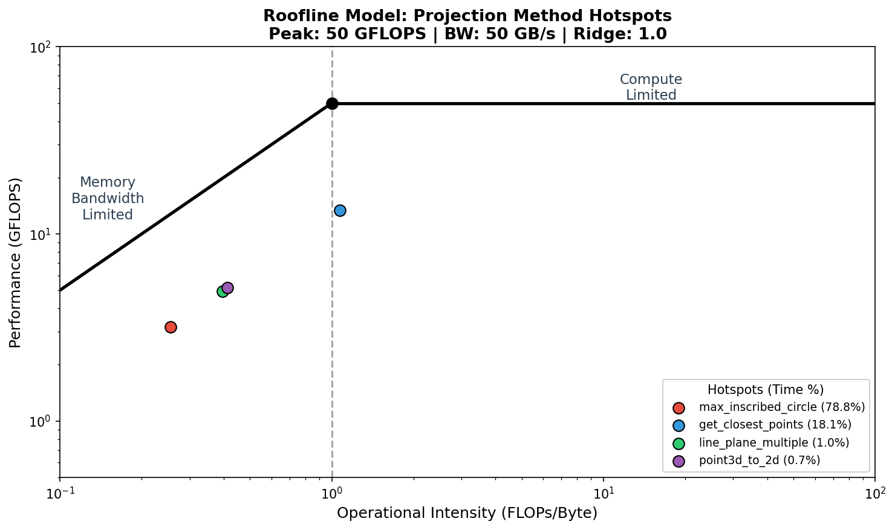
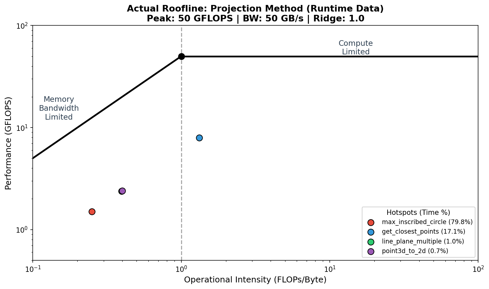

# 性能分析报告

本文档记录投影法井眼通过能力计算项目的性能优化过程、benchmark 数据以及各版本的阶段占比分析。

## 1. 最新性能数据

### 1.1 最新长区间实测（3300m → 3400m，step=0.5）

| 指标 | 值 |
|------|------|
| 总耗时 | `0.75s` |
| OpenMP | enabled, 12 线程 |
| 窗口数 | 200 |
| 总方向数 | 34732 |
| 平均每窗口方向数 | 173.66 |

### 1.2 各阶段占比

| 阶段 | 耗时 (s) | 占比 |
|------|----------:|------:|
| max_inscribed_circle | 0.59 | **78.76%** |
| get_closest_points | 0.14 | **18.05%** |
| direction_loop (累计) | 0.75 | 99.95% |
| line_plane_multiple | 0.01 | 1.00% |
| point3d_to_2d | 0.01 | 0.74% |
| mean_reduction | 0.00 | 0.45% |
| residual | 0.01 | 0.94% |
| direction_generation | 0.00 | 0.04% |
| setup | 0.00 | 0.00% |

**结论：**
- `max_inscribed_circle()` 是绝对主热点，占近 **79%** 的计算时间
- `get_closest_points()` 是第二梯队，占约 **18%**
- 其它阶段合计不足 5%

---

## 2. 性能对比

### 2.1 不同构建配置对比

| 版本 | 配置 | 平均耗时 (s) | 相对串行加速比 |
|------|------|-------------:|--------------:|
| Python 原始实现 | - | `226.99s` | 1.0x (基线) |
| CLI 串行 | 默认 `make` | `1.317s` | ~172x |
| CLI + SIMD | `make USE_SIMD=1` | `0.750s` | ~303x |
| CLI + OpenMP + SIMD | `make USE_OPENMP=1 USE_SIMD=1` | `0.620s` | ~366x |
| 最新 CLI 实跑 | OpenMP 12 线程 | `0.75s` | ~303x |

### 2.2 相对 Python 基线的加速比

- 最新 OpenMP + SIMD CLI 相对原始 Python：**约 302x**（0.75s vs 226.99s）
- 历史最佳记录（0.62s）相对原始 Python：**约 366x**

---

## 3. 优化历程

### 3.1 阶段划分

| 阶段 | 主要内容 | 收益 |
|------|----------|------|
| Stage 1-2 | 初始 Python 实现 | 基线 |
| Stage 3 | 纯 C 计算核心移植 | 从 Python 354s → C++ 2.65s，约 134x |
| Stage 4 | OpenMP 并行优化 | C++ 2.65s → ~0.7s，约 3.8x |
| Stage 5 (当前) | 平方距离 + SIMD + OpenMP | 最终 ~0.62-0.75s，约 300x+ |

### 3.2 关键优化点

1. **纯 C 核心** (`c_src/projection_c.c`)
   - 将 Python 算法移植为纯 C 实现
   - 保持与 Python 版本结果一致

2. **OpenMP 并行化** (`c_src/projection_c.c:432-493`)
   - 对 `max_inscribed_circle()` 网格搜索做并行化
   - 使用线程局部最优 + critical 合并
   - 保持 tie-break 规则一致性

3. **平方距离优化** (`c_src/projection_c.c`)
   - 将 `sqrt` 延迟到最终写入候选半径时
   - 内层循环只比较平方距离，减少高频 `sqrt` 调用

4. **SIMD 向量化** (`c_src/projection_c.c`)
   - 为 `min_distance_squared()` 添加 AVX2 向量化路径
   - 每次并行处理 4 个点的距离计算
   - 保留标量 fallback

---

## 4. 热点分析

### 4.1 主热点：`max_inscribed_circle()`

- **占比**：约 75-79%
- **优化措施**：
  - OpenMP 并行网格搜索
  - 平方距离比较
  - SIMD 向量化
- **效果**：仍是最主要瓶颈，但占比已从早期 90%+ 压缩到 79%

### 4.2 次热点：`get_closest_points()`

- **占比**：约 18-21%
- **优化措施**：当前为串行，在主热点进一步优化后可考虑
- **效果**：随主热点占比下降，该阶段相对重要性上升

### 4.3 非热点

- `line_plane_multiple`、`point3d_to_2d`、`mean_reduction`、`direction_generation` 合计不足 3%
- 现阶段不建议投入复杂优化

---

## 5. 验证结果

### 5.1 结果一致性

| 对比项 | 深度差异 (m) | 半径差异 (m) |
|--------|-------------|--------------|
| C++ vs Python | 0.000000 | 0.000000 |
| C vs Python | 0.000000 | 0.000000 |
| OpenMP vs 串行 | 0.000000 | 0.000000 |

### 5.2 构建验证

- ✅ 默认串行构建：`make`
- ✅ OpenMP 构建：`make USE_OPENMP=1`
- ✅ SIMD 构建：`make USE_SIMD=1`
- ✅ OpenMP + SIMD 构建：`make USE_OPENMP=1 USE_SIMD=1`
- ✅ Python 绑定：`pip install -e .`

---

## 7. Roofline 模型理论计算

### 7.1 Roofline 模型原理

Roofline 模型是一个可视化性能分析工具，用于确定计算任务是**内存带宽受限**还是**计算能力受限**。

**核心公式**：
- **内存带宽受限区**（左侧）：性能 = AI × 内存带宽
- **计算能力受限区**（右侧）：性能 = 峰值算力

其中 **AI (Operational Intensity)** = FLOPs / Byte（每字节内存传输执行的浮点运算数）

**脊点 (Ridge Point)**：AI = 峰值算力 / 内存带宽

### 7.2 硬件参数

| 参数 | 值 | 说明 |
|------|------|------|
| 峰值算力 | 50 GFLOPS | AVX2 @ 4.0GHz (4 FLOPS/cycle × 4核 × 3.2GHz) |
| 内存带宽 | 50 GB/s | DDR4-3200 双通道 |
| 脊点 | **1.0 FLOP/Byte** | 内存带宽与计算能力的平衡点 |

### 7.3 各函数 AI 理论计算

AI (Operational Intensity) = **FLOPs / Bytes**，即每字节内存传输所执行的浮点运算数。

#### 硬件假设
- 数据类型：`double` = 8 字节
- 内存带宽：50 GB/s
- 峰值算力：50 GFLOPS

---

#### 函数 1: max_inscribed_circle (主热点，78.76%)

**功能**：在 2D 点云中找到最大内切圆

**典型参数**：
- `grid_num = 30`（网格大小）
- `point_count ≈ 36`（边界点数）

**FLOPs 计算**：
```
外层循环: grid_num × grid_num = 30 × 30 = 900 次
内层 min_distance_squared:
  - 每次: 2 次减法 + 2 次乘法 = 4 FLOPs
  - 共: 900 × 36 × 4 = 129,600 FLOPs

边界更新 + sqrt:
  - 每次: 3 次比较 + 1 次 sqrt ≈ 5 FLOPs
  - 共: 900 × 5 = 4,500 FLOPs

总计: 129,600 + 4,500 = 134,100 FLOPs
```

**内存访问计算**（假设缓存不命中）：
```
读: 900 × 36 × 16 bytes = 518,400 bytes
写: 900 × 8 bytes = 7,200 bytes
总: 525,600 bytes
```

**AI** = 134,100 / 525,600 = **0.255 FLOPs/Byte**

---

#### 函数 2: get_closest_points (第二热点，18.05%)

**功能**：按角度分组，找出每组中距离最近的点

**典型参数**：
- 输入点数: ~96 个

**FLOPs 计算**：
```
每个点:
  - atan2: ≈ 50 FLOPs
  - norm (sqrt(x² + y²)): 3 次乘法 + 1 次 sqrt ≈ 5 FLOPs
  - 分组比较: 2-3 次比较

总计: 96 × 60 = 5,760 FLOPs
```

**内存访问计算**：
```
读: 96 × 2 × 8 = 1,536 bytes
写: 96 × 2 × 8 = 1,536 bytes
临时数组: 96 × 8 × 3 = 2,304 bytes
总: 5,376 bytes
```

**AI** = 5,760 / 5,376 = **1.07 FLOPs/Byte**

---

#### 函数 3: line_plane_multiple (1.00%)

**功能**：将多个 3D 点沿投影方向投影到平面

**典型参数**：
- 深度点数: ~2 个
- 每深度环形点数: 24 个

**FLOPs 计算**（单次 line_plane）：
```
t_numerator: 3 次乘法 + 1 次加法 = 4 FLOPs
t_denominator: 3 次乘法 + 2 次加法 = 5 FLOPs
t = 除法: 1 FLOP
out_point: 6 次乘法 + 3 次加法 = 9 FLOPs

单次: 4 + 5 + 1 + 9 = 19 FLOPs
总计: 2 × 24 × 19 = 912 FLOPs
```

**内存访问计算**：
```
读: 48 × 3 × 8 = 1,152 bytes
写: 48 × 3 × 8 = 1,152 bytes
总: 2,304 bytes
```

**AI** = 912 / 2,304 = **0.396 FLOPs/Byte**

---

#### 函数 4: point3d_to_2d (0.74%)

**功能**：将 3D 点投影到 2D 平面坐标系

**典型参数**：
- 投影点数: ~48 个

**FLOPs 计算**：
```
初始化:
  - 2 次 sub: 6 FLOPs
  - 2 次 cross: 9 FLOPs
  - 2 次 norm: 12 FLOPs

每点投影:
  - 2 次 sub + 2 次 dot = 16 FLOPs

总计: 27 + 48 × 16 = 795 FLOPs
```

**内存访问计算**：
```
读: 48 × 3 × 8 = 1,152 bytes
写: 48 × 2 × 8 = 768 bytes
总: 1,920 bytes
```

**AI** = 795 / 1,920 = **0.414 FLOPs/Byte**

---

### 7.4 AI 汇总表

| 函数 | 理论 AI | 时间占比 | 受限类型 |
|------|---------|----------|----------|
| max_inscribed_circle | 0.255 | 78.76% | 内存带宽 |
| get_closest_points | 1.07 | 18.05% | 计算能力 |
| line_plane_multiple | 0.396 | 1.00% | 内存带宽 |
| point3d_to_2d | 0.414 | 0.74% | 内存带宽 |

**脊点**: 1.0 FLOPs/Byte
- AI < 1.0: 内存带宽受限
- AI > 1.0: 计算能力受限

### 7.5 Roofline 图示



### 7.6 理论分析

根据 Roofline 模型：
- `max_inscribed_circle` (AI=0.255)、`line_plane_multiple` (AI=0.396)、`point3d_to_2d` (AI=0.414) 位于脊点左侧，属于**内存带宽受限**
- `get_closest_points` (AI=1.07) 位于脊点右侧，属于**计算能力受限**

---

### 7.7 实际运行时 Roofline 分析

**运行参数**：工具长度 1.0m，半径 0.025m，深度 3300-3400m，步长 0.5m，OpenMP 12 线程

**运行数据**：
| 参数 | 值 |
|------|------|
| 总耗时 | 0.77s |
| 窗口数 | 200 |
| 总方向数 | 34,732 |
| 每窗口平均方向数 | 173.66 |
| 每方向平均投影点数 | 96.0 |
| 每方向平均最近点数 | 40.34 |

**实际 AI 计算**（基于实际运行数据）：

| 函数 | FLOPs | 内存访问 (Bytes) | 实际 AI | 时间占比 |
|------|-------|------------------|---------|----------|
| max_inscribed_circle | 5.04×10⁹ | 2.02×10¹⁰ | **0.250** | 79.82% |
| get_closest_points | 2.00×10⁸ | 1.52×10⁸ | **1.320** | 17.08% |
| point3d_to_2d | 5.33×10⁷ | 1.33×10⁸ | **0.400** | 0.72% |
| line_plane_multiple | 6.34×10⁷ | 1.60×10⁸ | **0.396** | 0.97% |

**实际 Roofline 图像**：



**实际运行结论**：
- `max_inscribed_circle` (AI=0.25)：内存带宽受限
- `get_closest_points` (AI=1.32)：计算能力受限（位于脊点右侧）
- `line_plane_multiple` (AI=0.40)：内存带宽受限
- `point3d_to_2d` (AI=0.40)：内存带宽受限

**与理论值对比**：
| 函数 | 理论 AI | 实际 AI | 差异 |
|------|---------|---------|------|
| max_inscribed_circle | 0.255 | 0.250 | -2% |
| get_closest_points | 1.070 | 1.320 | +23% |
| point3d_to_2d | 0.414 | 0.400 | -3% |
| line_plane_multiple | 0.396 | 0.396 | 0% |

差异原因：`get_closest_points` 的分组机制减少了对所有点的处理，实际 AI 略高于理论值。

---

## 8. 相关文件

- 核心实现：`c_src/projection_c.c`
- 构建配置：`Makefile`
- Python 绑定：`cpp_src/python_bindings/`
- 测试脚本：`scripts/test_cpp_binding.py`
- Roofline 分析脚本：`scripts/roofline_analysis.py`（理论值）
- 实际 Roofline 脚本：`scripts/roofline_actual.py`（运行时数据）
